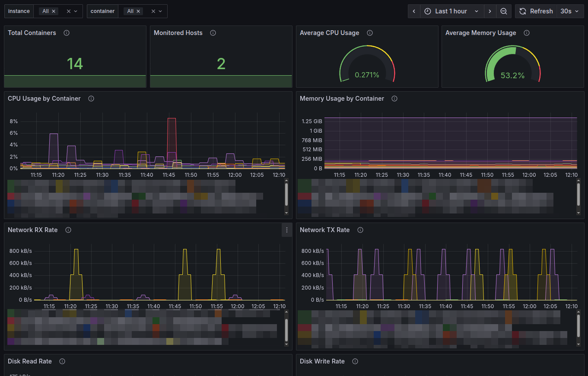

# Prometheus Docker Stats Exporter (Bash/Systemd)

A lightweight, bash-based Prometheus exporter that collects Docker container statistics using the native `docker stats` command and runs as a systemd service.

## Features

- **Pure Bash Implementation**: No Python, Go, or other runtime dependencies
- **Systemd Integration**: Runs as a native systemd service with proper security settings
- **Lightweight**: Minimal resource usage and dependencies
- **Real-time Metrics**: Collects CPU, memory, network I/O, block I/O, and PID statistics
- **Prometheus Compatible**: Standard Prometheus metrics format with proper labels
- **Easy Installation**: Automated installation script with user management
- **Configurable**: Customizable collection intervals, ports, and logging levels
- **Secure**: Runs with restricted permissions and dedicated user account

## Quick Setup

```bash
# Clone the repository
git clone https://github.com/itefixnet/prometheus-dockerstats-exporter.git
cd prometheus-dockerstats-exporter

# Make script executable
chmod +x docker-stats-exporter.sh

# Test the exporter
./docker-stats-exporter.sh --help
./docker-stats-exporter.sh --port 9417 --log-level INFO

# For systemd service setup, see Installation section below
```

## Metrics Exported

| Metric Name | Description | Labels |
|-------------|-------------|--------|
| `docker_container_cpu_usage_percent` | CPU usage percentage of the container | `instance`, `container_id`, `container_name` |
| `docker_container_memory_usage_bytes` | Memory usage in bytes | `instance`, `container_id`, `container_name` |
| `docker_container_memory_limit_bytes` | Memory limit in bytes | `instance`, `container_id`, `container_name` |
| `docker_container_memory_usage_percent` | Memory usage percentage | `instance`, `container_id`, `container_name` |
| `docker_container_network_rx_bytes_total` | Total network bytes received | `instance`, `container_id`, `container_name` |
| `docker_container_network_tx_bytes_total` | Total network bytes transmitted | `instance`, `container_id`, `container_name` |
| `docker_container_block_io_read_bytes_total` | Total block I/O bytes read | `instance`, `container_id`, `container_name` |
| `docker_container_block_io_write_bytes_total` | Total block I/O bytes written | `instance`, `container_id`, `container_name` |
| `docker_container_pids` | Number of PIDs in the container | `instance`, `container_id`, `container_name` |
| `docker_stats_exporter_up` | Exporter status (1=up, 0=down) | `instance` |
| `docker_stats_exporter_last_scrape_timestamp_seconds` | Last scrape timestamp | `instance` |

## System Requirements

- **Operating System**: Linux with systemd
- **Docker**: Docker daemon running and accessible
- **Dependencies**: `bash`, `bc`, `socat`, `systemctl`
- **Permissions**: Root access for installation (service can run as non-root user)

### Installation Dependencies

**Ubuntu/Debian:**
```bash
sudo apt-get update
sudo apt-get install docker.io bc socat
```

**RHEL/CentOS:**
```bash
sudo yum install docker bc socat
# or for newer versions:
sudo dnf install docker bc socat
```

**Note**: Only `socat` is required for HTTP server functionality. The exporter no longer supports `netcat`.

## Manual Installation

### 1. Copy Files

```bash
# Create directory (adjust path as needed)
sudo mkdir -p /opt/docker-stats-exporter
sudo cp docker-stats-exporter.sh /opt/docker-stats-exporter/
sudo cp docker-stats-exporter.conf /opt/docker-stats-exporter/
sudo chmod +x /opt/docker-stats-exporter/docker-stats-exporter.sh
```

### 2. Create User (Optional)

For security, create a dedicated user:
```bash
sudo useradd --system --home-dir /opt/docker-stats-exporter --no-create-home --shell /bin/false docker-stats
sudo usermod -a -G docker docker-stats  # Add to docker group
sudo chown -R docker-stats:docker-stats /opt/docker-stats-exporter
```

### 3. Install Systemd Service

First, update the service file with the correct path:
```bash
# Edit docker-stats-exporter.service and set the correct ExecStart path
# Change: ExecStart=/path/to/docker-stats-exporter.sh
# To:     ExecStart=/opt/docker-stats-exporter/docker-stats-exporter.sh

sudo cp docker-stats-exporter.service /etc/systemd/system/
sudo systemctl daemon-reload
sudo systemctl enable docker-stats-exporter
sudo systemctl start docker-stats-exporter
```

**Note**: The service file requires you to update the `ExecStart` path to match your installation directory.

### 4. Verify Installation

```bash
sudo systemctl status docker-stats-exporter
curl http://localhost:9417/metrics
```

## Configuration

### Default Configuration

The exporter installs with these defaults:
- **Port**: 9417
- **Collection Interval**: 15 seconds
- **Log Level**: INFO
- **Bind Address**: 0.0.0.0 (all interfaces)

### Configuration File

Edit `/opt/docker-stats-exporter/docker-stats-exporter.conf`:

```bash
# Port to expose metrics on
PORT=9417

# Collection interval in seconds  
INTERVAL=15

# Log level: DEBUG, INFO, WARN, ERROR
LOG_LEVEL="INFO"

# Bind address (use 0.0.0.0 to bind to all interfaces)
BIND_ADDRESS="0.0.0.0"

# Instance name for metrics labels (defaults to hostname)
INSTANCE_NAME="docker-host-1"
```

After changing configuration, restart the service:
```bash
sudo systemctl restart docker-stats-exporter
```

## Service Management

### Service Configuration

The provided `docker-stats-exporter.service` file is a minimal systemd service configuration. Before installation, you must update the `ExecStart` path:

```ini
[Unit]
Description=Prometheus Docker Stats Exporter
After=docker.service

[Service]
Type=simple
ExecStart=/opt/docker-stats-exporter/docker-stats-exporter.sh  # Update this path
Restart=on-failure
RestartSec=5

[Install]
WantedBy=multi-user.target
```

### Security Considerations

The default service runs as root for Docker socket access. For production environments, consider:

1. **Create dedicated user**:
   ```bash
   sudo useradd --system --home-dir /opt/docker-stats-exporter --shell /bin/false docker-stats
   sudo usermod -a -G docker docker-stats
   ```

2. **Add to service file**:
   ```ini
   User=docker-stats
   Group=docker-stats
   ```

### Basic Commands

```bash
# Start the service
sudo systemctl start docker-stats-exporter

# Stop the service
sudo systemctl stop docker-stats-exporter

# Restart the service
sudo systemctl restart docker-stats-exporter

# Check service status
sudo systemctl status docker-stats-exporter

# Enable auto-start on boot
sudo systemctl enable docker-stats-exporter

# Disable auto-start on boot
sudo systemctl disable docker-stats-exporter
```

### Viewing Logs

```bash
# Follow live logs
sudo journalctl -u docker-stats-exporter -f

# View recent logs
sudo journalctl -u docker-stats-exporter -n 50

# View logs from specific time
sudo journalctl -u docker-stats-exporter --since "1 hour ago"
```

### Log Files

- **Journal logs**: `journalctl -u docker-stats-exporter`
- **Service log file**: `{WorkingDirectory}/docker-stats-exporter.log`
- **Metrics file**: `{WorkingDirectory}/metrics.prom`

## Manual Usage (Development/Testing)

You can run the exporter manually for testing:

```bash
# Make script executable
chmod +x docker-stats-exporter.sh

# Run with default settings
./docker-stats-exporter.sh

# Run with custom settings
./docker-stats-exporter.sh --port 9418 --interval 30 --log-level DEBUG

# View help
./docker-stats-exporter.sh --help
```

### Command Line Options

| Option | Default | Description |
|--------|---------|-------------|
| `--port PORT` | 9417 | Port to expose metrics on |
| `--interval SECONDS` | 15 | Collection interval in seconds |
| `--log-level LEVEL` | INFO | Log level (DEBUG, INFO, WARN, ERROR) |
| `--bind-address ADDR` | 0.0.0.0 | Address to bind HTTP server to |
| `--instance-name NAME` | hostname | Instance name for metrics labels |
| `--config FILE` | `./docker-stats-exporter.conf` | Configuration file path |

## Prometheus Configuration

The repository includes an example Prometheus configuration file (`prometheus-config-example.yml`).

### Single Host Configuration

Add this job to your `prometheus.yml`:

```yaml
scrape_configs:
  - job_name: 'docker-stats-exporter'
    static_configs:
      - targets: ['localhost:9417']
        labels:
          instance: 'docker-host-1'  # This adds the instance label
    scrape_interval: 15s
    metrics_path: /metrics
```

### Multi-Host Configuration

For monitoring multiple hosts:

```yaml
scrape_configs:
  - job_name: 'docker-stats-exporter-multi'
    static_configs:
      - targets: ['host1:9417']
        labels:
          instance: 'docker-host-1'
      - targets: ['host2:9417'] 
        labels:
          instance: 'docker-host-2'
      - targets: ['host3:9417']
        labels:
          instance: 'docker-host-3'
    scrape_interval: 15s
    metrics_path: /metrics
```

**Important**: The `instance` label is crucial for the Grafana dashboard to work properly with multiple hosts.

## Grafana Dashboard

A comprehensive Grafana dashboard is provided that supports monitoring multiple hosts:

### Features
- **Multi-host support** with host selection dropdown
- **Container filtering** across all hosts
- **Overview statistics** (total containers, host count, averages)
- **Time-series charts** for CPU, memory, network, and disk I/O
- **Top containers** tables by CPU and memory usage
- **Cross-host comparison** capabilities

### Quick Setup
```bash
# 1. Import dashboard into Grafana
#    Use the grafana-dashboard.json file in this repository
#    Go to Grafana → "+" → Import → Upload JSON file

# 2. Configure Prometheus to scrape multiple hosts
#    Add all your Docker stats exporter endpoints to prometheus.yml

# 3. Select hosts and containers using dashboard variables
#    Use the dropdowns at the top to filter data
```

### Dashboard Panels
- **Overview**: Total containers, monitored hosts, average CPU/memory
- **CPU Usage**: Time series by container across all hosts
- **Memory Usage**: Memory consumption by container
- **Network I/O**: RX/TX rates per container
- **Disk I/O**: Read/write rates per container
- **Top Lists**: Highest resource consumers

### Import Instructions
1. In Grafana, go to **Dashboards** → **New** → **Import**
2. Upload the `grafana-dashboard.json` file from this repository
3. Select your Prometheus datasource when prompted
4. Click **Import**

The dashboard will automatically detect and display all hosts running the exporter.

## Example Queries

### CPU Usage
```promql
# Average CPU usage across all containers
avg(docker_container_cpu_usage_percent)

# Top 5 containers by CPU usage
topk(5, docker_container_cpu_usage_percent)

# Containers using more than 50% CPU
docker_container_cpu_usage_percent > 50
```

### Memory Usage
```promql
# Memory usage in GB
docker_container_memory_usage_bytes / 1024 / 1024 / 1024

# Memory usage percentage
docker_container_memory_usage_percent

# Containers using more than 80% memory
docker_container_memory_usage_percent > 80
```

### Network I/O
```promql
# Network receive rate (bytes/sec)
rate(docker_container_network_rx_bytes_total[5m])

# Network transmit rate (bytes/sec)
rate(docker_container_network_tx_bytes_total[5m])

# Total network traffic
docker_container_network_rx_bytes_total + docker_container_network_tx_bytes_total
```

### Block I/O
```promql
# Disk read rate (bytes/sec)
rate(docker_container_block_io_read_bytes_total[5m])

# Disk write rate (bytes/sec)
rate(docker_container_block_io_write_bytes_total[5m])
```

## Security Features

The exporter includes several security considerations:

- **Minimal dependencies**: Only requires `bash`, `bc`, and `socat`
- **Docker socket access**: Requires Docker group membership or root access
- **HTTP server**: Uses `socat` for lightweight, secure HTTP serving
- **Configuration**: Supports custom bind addresses and non-privileged ports
- **Instance labels**: Prevents metric conflicts in multi-host environments

For production deployments, run as a dedicated user with Docker group access.

## Troubleshooting

### Service Won't Start

1. **Check service status:**
   ```bash
   sudo systemctl status docker-stats-exporter
   ```

2. **Check logs:**
   ```bash
   sudo journalctl -u docker-stats-exporter -f
   ```

3. **Verify service file path:**
   ```bash
   # Make sure the ExecStart path in the service file is correct
   sudo systemctl cat docker-stats-exporter
   ```

4. **Check dependencies:**
   ```bash
   which docker bc socat
   ```

5. **Test Docker access:**
   ```bash
   docker stats --no-stream
   ```

### No Metrics Appearing

1. **Test metrics endpoint:**
   ```bash
   curl http://localhost:9417/metrics
   ```

2. **Check if containers are running:**
   ```bash
   docker ps
   ```

3. **Verify Docker stats command:**
   ```bash
   # Test the exact command the exporter uses
   docker stats --no-stream --format "{{.Container}}\t{{.Name}}\t{{.CPUPerc}}\t{{.MemUsage}}\t{{.MemPerc}}\t{{.NetIO}}\t{{.BlockIO}}\t{{.PIDs}}"
   ```

4. **Check parsing with debug mode:**
   ```bash
   # Run manually with debug logging
   ./docker-stats-exporter.sh --log-level DEBUG --port 9418
   ```

### Permission Issues

1. **Check user has Docker access:**
   ```bash
   # If running as specific user, check group membership
   groups docker-stats  # or whatever user you configured
   
   # Test Docker access
   docker ps
   ```

2. **Restart Docker service:**
   ```bash
   sudo systemctl restart docker
   ```

3. **Check Docker socket permissions:**
   ```bash
   ls -la /var/run/docker.sock
   ```

### High Resource Usage

1. **Increase collection interval:**
   ```bash
   # Edit /opt/docker-stats-exporter/docker-stats-exporter.conf
   INTERVAL=30
   sudo systemctl restart docker-stats-exporter
   ```

2. **Reduce log level:**
   ```bash
   LOG_LEVEL="WARN"
   sudo systemctl restart docker-stats-exporter
   ```

## Uninstallation

To remove the exporter:

```bash
# Stop and disable service
sudo systemctl stop docker-stats-exporter
sudo systemctl disable docker-stats-exporter

# Remove service file
sudo rm /etc/systemd/system/docker-stats-exporter.service
sudo systemctl daemon-reload

# Remove installation directory (adjust path as needed)
sudo rm -rf /opt/docker-stats-exporter

# Remove user (if created)
sudo userdel docker-stats  # or whatever user you created
```

## Development

### File Structure
```
├── docker-stats-exporter.sh       # Main exporter script
├── docker-stats-exporter.service  # Systemd service file
├── docker-stats-exporter.conf     # Configuration file
├── grafana-dashboard.json          # Grafana dashboard for multi-host monitoring
├── prometheus-config-example.yml  # Example Prometheus configuration
├── LICENSE                        # MIT license
└── README.md                      # This documentation
```

### Contributing

1. Fork the repository
2. Create a feature branch: `git checkout -b feature-name`
3. Test your changes thoroughly
4. Commit with descriptive messages
5. Push and create a Pull Request

### Testing

```bash
# Test script syntax
bash -n docker-stats-exporter.sh

# Test with debug logging
./docker-stats-exporter.sh --log-level DEBUG

# Test metrics endpoint
curl http://localhost:9417/metrics | head -20
```

## License

This project is licensed under the MIT License - see the [LICENSE](LICENSE) file for details.

## Changelog

### Latest
- **Fixed Docker stats parsing**: Removed `table` format to fix container name extraction
- **Added instance labels**: All metrics now include `instance` label for multi-host support
- **Improved HTTP server**: Socat-only implementation with proper Content-Length headers
- **Enhanced Grafana dashboard**: Multi-host support with filtering variables
- **Added debug logging**: Better troubleshooting with raw Docker output logging
- **Updated documentation**: Fixed paths, added missing configuration options
- **Prometheus config example**: Added `prometheus-config-example.yml` file

### v1.0.0
- Initial bash-based implementation
- Systemd service integration
- Security hardening
- Comprehensive documentation
- Support for all major Docker stats metrics